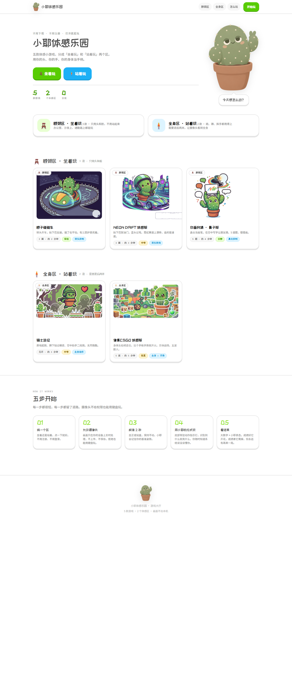

# 🌵 小耶体感乐园

**打开浏览器就能玩**的体感小游戏合集。不用下载、不用注册。

分成「坐着玩」和「站着玩」两个区，**全部开源**。



---

## 有什么

### 🪑 脖颈区 · 坐着玩（只用头和脸）

| 游戏 | 玩法 | 操作 |
| --- | --- | --- |
| 脖子碰碰车 | 3D 碰碰车竞速 | 转头转向，抬下巴加速 |
| NEON DRIFT | 霓虹街机赛车 | 抬下巴踩油门，歪头过弯 |
| 你画我猜 · 鼻子版 | 鼻尖当画笔 | 用鼻子在空中写字 |

### 🧍 全身区 · 站着玩（需要退后两米）

| 游戏 | 玩法 | 操作 |
| --- | --- | --- |
| 骑士远征 | 无尽跑酷 | 原地跳、蹲下、空中拍手 |
| 像素CSGO | 方块战场射击 | 身体倾斜走位、手枪手势开火 |

---

## 怎么跑起来

```bash
# 任选一个静态服务器，本质都一样
python -m http.server 8123
```

然后打开 `http://127.0.0.1:8123/`

> ⚠️ **不能直接双击 `index.html`。**
> 一是浏览器不允许 `file://` 下调用摄像头；
> 二是游戏清单是 `fetch` 来的，`file://` 下会失败。

### 摄像头必须 https

浏览器规定调用摄像头必须是**安全上下文**：`localhost` 和 `https://` 算，局域网 IP 的 `http://` **不算**。

- **本机调试** → `http://127.0.0.1:8123/` 没问题
- **手机上玩** → 必须部署到 https 站点

---

## 项目结构

```
.
├─ index.html          ← 网站入口（构建产物，别直接改）
├─ games.json          ← 游戏清单（构建时自动导出，别直接改）
├─ games/              ← 所有游戏，一个游戏一个文件夹
│   ├─ _template/      ← 新游戏模板，加游戏就复制它
│   ├─ bumper/  nose/  drift/  knight/  voxel/
├─ src/page.html       ← 大厅源文件（改这个）
├─ build/build.py      ← 构建脚本
├─ assets/             ← 封面、角色素材
└─ docs/               ← 截图
```

**大厅的源文件是 `src/page.html`，不是 `index.html`。**
`index.html` 是把图片内联进去之后的产物，改它会在下次构建时被覆盖。

改完源文件重新构建：

```bash
python build/build.py
```

---

## 怎么加一个游戏

详情看 [CONTRIBUTING.md](CONTRIBUTING.md)，简单说三步：

1. 把 `games/_template/` 复制成 `games/你的游戏名/`，填内容
2. 在 `src/page.html` 的 `games-data` 清单里加一条
3. 跑 `python build/build.py`，本地确认能玩，提 PR

**不用碰大厅的任何逻辑代码。**

---

## 技术栈

- 纯静态：无框架、无打包、无依赖
- 大厅：原生 HTML / CSS / JS，单文件
- 游戏：各自独立，通过 `iframe` 加载
- 体感：MediaPipe（FaceMesh / Pose / Hands）+ Three.js，走 CDN

---

## 授权

| 内容 | 许可证 |
| --- | --- |
| **代码** | [MIT](LICENSE) —— 随便用，保留署名 |
| **小耶角色与美术素材** | [CC BY-NC 4.0](LICENSE-ART.md) —— 可署名使用，**不可商用** |
| **`games/` 里各游戏的素材** | 归各作者，见其文件夹内说明 |

---

## 作者

**ZYZ-009** · [github.com/ZYZ-009](https://github.com/ZYZ-009)

欢迎提 Issue 和 PR。
